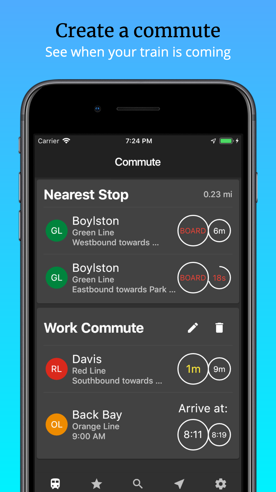
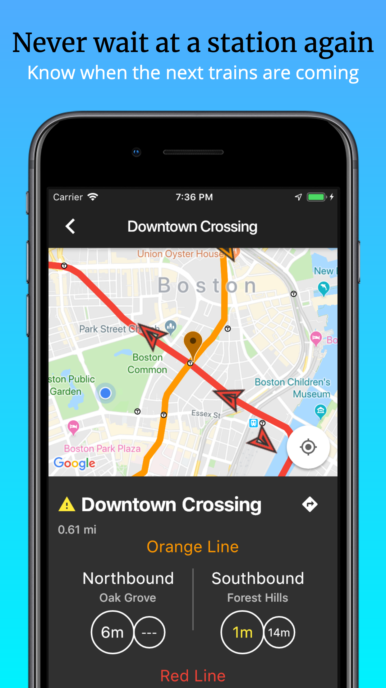
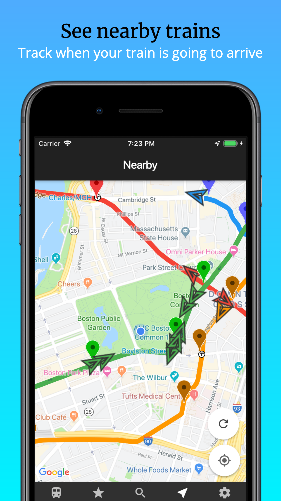
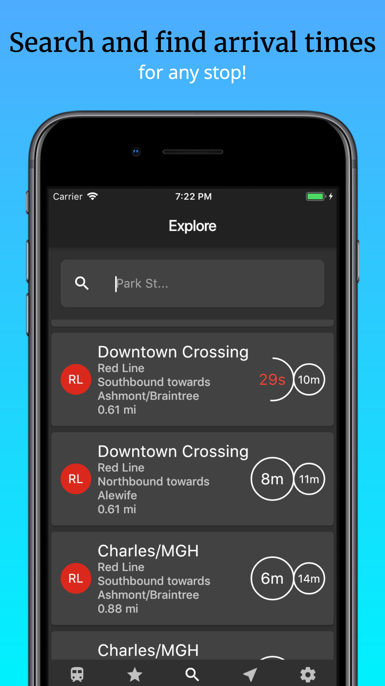
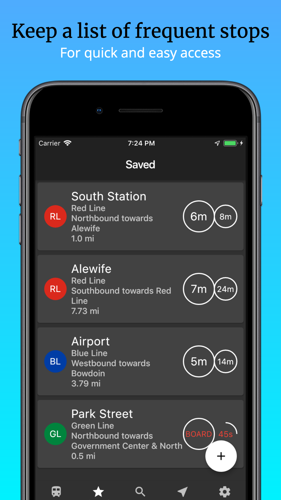

# meTro: MBTA Subway Tracker and Companion App

Making your Boston commute and travel easier by the day

## Getting Started

Have you ever walked into a station just to find out that the next train doesn't come for 10 more minutes?

Have you ever had to decide between taking the T or walking to your destination, and wanted to know when the next train arrived at the station?

Have you ever swiped into a station just to find out that a shuttle bus is temporarily replacing the subway?

meTro is a Boston MBTA assistant that provides real-time updates of all of the subways operating in Boston.

meTro provides easy access to arrival times of your favorite stops as well as alerts and delays.

4 different ways to get the information you need:

Commute:
Create a commute between two stops and automatically receive real-time updates of train arrival times for the appropriate stop.

Saved:
Add stops to your saved list to grant easy access to stop information such as arrival times, location, alerts, and delays.

Explore:
Search through all of the stops that the T services to find the one you're looking for.

Nearby:
A map view of the stops closest to you to find the best stop to get on from where you are.

Future Plans:
Add MBTA bus support
Push notifications for alerts and your commute

All app icon design and creation efforts are contributed to Caroline Thibault.

meTro is not affiliated with the MBTA.

